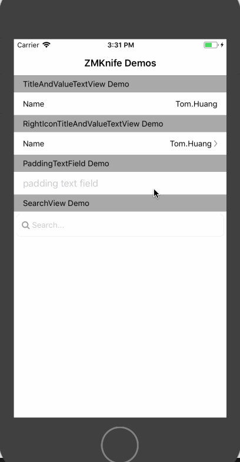

# ZMKnife
Some widgets I often used in projects for iOS

# Screenshot



# Setup

#### Install with [CocoaPods](http://cocoapods.org/)

```ruby
pod 'ZMKnife', '~> 0.1.1'
```

# Widgets

* [PaddingLabel](Source/PaddingLabel.swift)
* [PaddingTextField](Source/PaddingTextField.swift)
* [TitleTextField](Source/TitleTextField.swift)
* [BorderBottomView](Source/BorderBottomView.swift)
* [TitleAndValueTextView](Source/TitleAndValueTextView.swift)
* [RightIconTitleAndValueTextView](Source/RightIconTitleAndValueTextView.swift)
* [SearchView](Source/SearchView.swift)

#### [Example](Example/Example/ViewController.swift)

# License

[MIT](LICENSE)